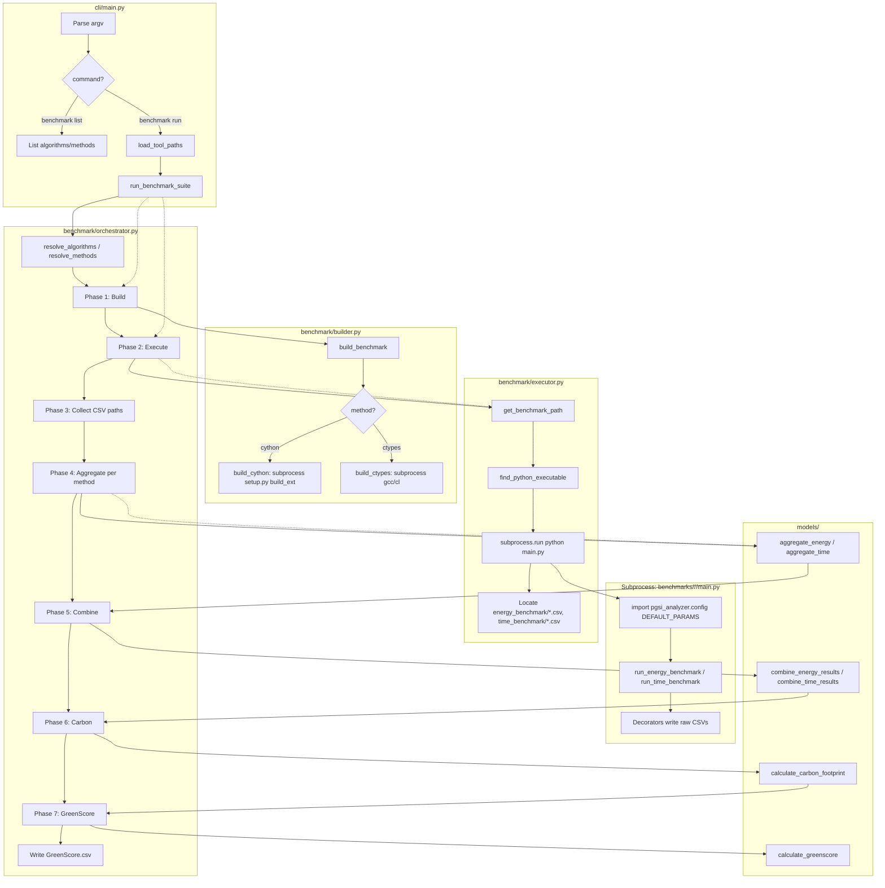

# PGSI Analyzer — Architecture & Dependency Analysis

**Document version:** 1.0  
**Purpose:** Internal technical structure, process boundaries, data pipeline, and interface contracts (Issue #2).

---

## 1. Source Layout (src/)

```
src/pgsi_analyzer/
├── __init__.py
├── config.py                 # ToolPaths, load_tool_paths, (DEFAULT_PARAMS if present)
├── cli/
│   ├── __init__.py           # re-exports main
│   └── main.py               # argparse, benchmark list/run → run_benchmark_suite
├── benchmark/
│   ├── __init__.py
│   ├── orchestrator.py       # run_benchmark_suite (build → execute → aggregate → combine → carbon → GreenScore)
│   ├── executor.py           # execute_benchmark, find_python_executable, prepare_py_compile; subprocess.run
│   └── builder.py            # build_benchmark, build_cython, build_ctypes
├── benchmarks/
│   ├── __init__.py
│   ├── registry.py           # BENCHMARKS map, list_algorithms, list_methods, get_benchmark_path, validate_*
│   └── <algorithm>/<method>/main.py   # per-benchmark scripts (decorated run_energy_benchmark, run_time_benchmark)
├── models/
│   ├── __init__.py
│   ├── aggregation.py       # aggregate_energy, aggregate_time
│   ├── combination.py       # combine_energy_results, combine_time_results
│   ├── carbon.py            # calculate_carbon_footprint
│   └── greenscore.py        # normalize_metrics, calculate_greenscore
├── measurement/
│   ├── energy.py            # measure_energy_to_csv (pyRAPL or estimation)
│   ├── time.py              # measure_time_to_csv
│   └── estimators.py        # estimate_energy (non-Linux)
├── platform/
│   ├── __init__.py
│   ├── detection.py         # detect_platform, is_linux_intel, ...
│   ├── hardware.py          # get_cpu_info, get_system_info, check_rapl_support
│   └── paths.py             # get_user_data_dir, resolve_data_path, resolve_benchmark_path
└── utils/
    ├── __init__.py
    ├── validation.py        # validate_file_path, validate_dataframe, validate_weights, validate_platform, require_columns
    └── errors.py            # PGSIAnalyzerError, MeasurementError, AnalysisError, PlatformError, ConfigurationError
```

---

## 2. Process Boundaries: CLI → Orchestrator → Executor → subprocess.run()

### 2.1 Flow Summary

1. **cli/main.py**  
   Parses `pgsi-analyzer benchmark run` (and list). For `run`, calls `load_tool_paths(...)` then **run_benchmark_suite(...)** with algorithms, methods, runs, output_dir, carbon_intensity, alpha, beta, gamma, tool_paths.

2. **benchmark/orchestrator.py**  
   **run_benchmark_suite**:
   - Resolves algorithm/method lists (resolve_algorithms, resolve_methods).
   - **Phase 1:** For each (algorithm, method) with `requires_build(method)`, calls **build_benchmark(...)** (builder); on exception prints "✗ Error" and continues.
   - **Phase 2:** For each (algorithm, method), calls **execute_benchmark(...)** (executor); on exception prints "✗ Error" and continues.
   - **Phase 3–4:** Collects raw CSV paths from execution_results, groups by method, copies into temp dirs, calls **aggregate_energy** / **aggregate_time** per method.
   - **Phase 5–7:** **combine_energy_results**, **combine_time_results**, **calculate_carbon_footprint**, **calculate_greenscore**; writes GreenScore.csv. If no aggregated data at Phase 5, raises **AnalysisError**.

3. **benchmark/executor.py**  
   **execute_benchmark**:
   - Resolves Python executable via **find_python_executable(method, tool_paths)** (uses ToolPaths).
   - For py_compile: **prepare_py_compile(benchmark_path, tool_paths)** then runs Python on .pyc or main.py.
   - Otherwise: builds `exec_args = [python_exe, path_to_main_py]` (no extra CLI arguments).
   - Sets **env** = copy of `os.environ`, then sets **PYTHONPATH** to include package root (`Path(__file__).parent.parent.parent`).
   - Runs **subprocess.run(exec_args, cwd=benchmark_dir, env=exec_env, capture_output=True, text=True, timeout=3600)**.
   - On non-zero return code: raises **MeasurementError** with command, return code, stdout, stderr. On **subprocess.TimeoutExpired**: raises **MeasurementError**. Other exceptions wrapped in **MeasurementError**.
   - After success, locates energy/time CSVs under search dirs (energy_benchmark/, time_benchmark/, etc.) and returns `{ "energy_csv", "time_csv", "system_info" }`.

4. **benchmarks/\<algo\>/\<method\>/main.py**  
   Run as `python main.py` in the benchmark directory. No argv arguments are passed. Scripts use **DEFAULT_PARAMS** from `pgsi_analyzer.config` (algorithm-specific keys) for run count and parameters; they call `run_energy_benchmark` and `run_time_benchmark` (decorated with measure_energy_to_csv / measure_time_to_csv), which write CSVs under the **current working directory** (energy_benchmark/, time_benchmark/).

### 2.2 Data Movement: Main Process vs Benchmark Subprocesses

| Direction | Mechanism | Content |
|-----------|-----------|--------|
| **Main → subprocess** | **Process creation** | `exec_args = [python_exe, main_py_path]`; no additional CLI arguments. |
| **Main → subprocess** | **Environment** | `env` = copy of `os.environ` with **PYTHONPATH** set to package root so subprocess can `import pgsi_analyzer.*`. |
| **Main → subprocess** | **Working directory** | `cwd` = benchmark directory (parent of main.py or the directory itself). |
| **Subprocess → main** | **Exit code** | 0 = success; non-zero causes executor to raise MeasurementError. |
| **Subprocess → main** | **Filesystem** | Benchmark scripts write CSVs under cwd (energy_benchmark/*.csv, time_benchmark/*.csv). Executor discovers these paths after subprocess.run() returns and returns them in the result dict. |

**Important:** The `runs` parameter from the CLI is passed to **execute_benchmark(runs=...)** but is **not** passed to the benchmark script. The script’s run count is determined by the decorators’ `n` argument, which is set from **DEFAULT_PARAMS** at import time. Thus the CLI `--runs` value does not currently control how many times each benchmark runs inside the subprocess (potential gap; see Spike Rule below).

---

## 3. Data Pipeline: Raw CSV → Aggregated → Combined → GreenScore

| Stage | Location | Input | Output | Source of truth |
|-------|----------|--------|--------|------------------|
| **Measurement** | Subprocess (benchmark main.py) | N/A (decorators run the workload) | **Raw energy CSV**: `timestamp`, `function`, `run`, `package (uJ)`, `dram (uJ)`, `measurement_method`. **Raw time CSV**: `timestamp`, `function`, `run`, `execution_time (s)`. Written under `energy_benchmark/`, `time_benchmark/`. | measurement/energy.py, measurement/time.py |
| **Aggregation** | Main process (orchestrator Phase 4) | Folders of raw CSVs per method (after copying into temp dirs). | **Per-method aggregated CSVs**: `filename`, `average_package (uJ)` (energy) or `filename`, `execution_time (s)` (time). Saved as `output_dir/<method>/energy_aggregated.csv`, `output_dir/<method>/time_aggregated.csv`. | models/aggregation.py |
| **Combination** | Main process (orchestrator Phase 5) | List of aggregated CSV paths (one per method); method name inferred from **parent directory name**. | **energy_combined.csv**: `algorithm` + one column per method (energy μJ). **time_combined.csv**: `algorithm` + one column per method (time s). | models/combination.py |
| **Carbon** | Main process (orchestrator Phase 6) | energy_combined.csv | **carbon_footprint.csv**: `algorithm` + method columns with `_CO2e_g` suffix (g CO₂e). | models/carbon.py |
| **GreenScore** | Main process (orchestrator Phase 7) | energy_combined, time_combined, carbon_footprint DataFrames | **GreenScore.csv**: `method`, `energy_mean`, `time_mean`, `carbon_mean`, `green_score` (sorted by green_score ascending). | models/greenscore.py |

**Source of truth for pipeline control:** **orchestrator.py** decides the sequence and file layout; **registry.py** is the source of truth for which (algorithm, method) exist and their paths. The **contract** for data between stages is the CSV column names and (for combination) the convention that method name = parent directory name of the aggregated file.

---

## 4. Internal Contracts (CSV Formats)

| Contract | Required columns | Produced by | Consumed by |
|----------|------------------|-------------|-------------|
| **Raw energy CSV** | `package (uJ)` (and optionally timestamp, function, run, dram (uJ), measurement_method) | measurement/energy.py (decorator) | models/aggregation.aggregate_energy |
| **Raw time CSV** | `execution_time (s)` (and optionally timestamp, function, run) | measurement/time.py (decorator) | models/aggregation.aggregate_time |
| **Aggregated energy** | `filename`, `average_package (uJ)` | models/aggregation.aggregate_energy | models/combination.combine_energy_results |
| **Aggregated time** | `filename`, `execution_time (s)` (same column name; one row per file, value = mean) | models/aggregation.aggregate_time | models/combination.combine_time_results |
| **Combined energy** | `algorithm` + one column per method (numeric μJ) | models/combination.combine_energy_results | models/carbon, models/greenscore |
| **Combined time** | `algorithm` + one column per method (numeric seconds) | models/combination.combine_time_results | models/greenscore |
| **Carbon** | `algorithm` + method columns with `_CO2e_g` suffix | models/carbon.calculate_carbon_footprint | models/greenscore.calculate_greenscore |
| **GreenScore** | `method`, `energy_mean`, `time_mean`, `carbon_mean`, `green_score` | models/greenscore.calculate_greenscore | User / downstream analysis |

**Filename convention:** Combination expects **method name** to be the **parent directory name** of each aggregated file (e.g. `cpython/energy_aggregated.csv` → method `cpython`). Executor/orchestrator place aggregated files under `output_dir/<method>/` to satisfy this.

---

## 5. IPC / Interface Contract: Executor → Benchmark Scripts

### 5.1 CLI Arguments

- **None.** The executor invokes the benchmark as `python <path_to_main.py>` with **no** additional command-line arguments. Algorithm parameters (e.g. depth, n, iterations) and run count (`n` in decorators) come from the benchmark’s own config (e.g. **DEFAULT_PARAMS** from `pgsi_analyzer.config`), not from argv.

### 5.2 Environment Variables Passed to Subprocess

- **Inherited:** Full copy of `os.environ` (so all user env vars are present).
- **Set by executor:**  
  - **PYTHONPATH**: Set to the package root (directory containing `pgsi_analyzer`) so that `import pgsi_analyzer.measurement`, `import pgsi_analyzer.config`, etc. work inside the benchmark script.

No other PGSI-specific variables are set by the executor for the benchmark subprocess.

### 5.3 Environment Variables Used by Main Process (Before Subprocess)

- **PGSI_PYTHON_PATH**, **PGSI_PYPY_PATH**, **PGSI_CC_PATH**: Read by **load_tool_paths** (from .env or environment) to populate **ToolPaths**. These are not passed into the benchmark subprocess; they only affect which Python/PyPy/compiler the main process uses to build and run.

---

## 6. Error Propagation: Build and Execution Failures

### 6.1 Builder (Cython / ctypes)

- **builder.build_cython** / **build_ctypes** / **build_benchmark** raise:
  - **ConfigurationError**: setup.py missing, build failed, timeout, or other build error.
  - **PlatformError**: C compiler not found (e.g. for ctypes).
- **Orchestrator (Phase 1):** Calls `build_benchmark(...)` inside a broad `try: ... except Exception as e:`. It does **not** re-raise; it prints `✗ Error: {e}` and **continue**s to the next (algorithm, method). So build failures are **caught and reported to the user only via the printed message**; the suite continues. That (algorithm, method) is simply not added to `built_benchmarks`, so Phase 2 will use `get_benchmark_path` for that pair (and execution may then fail if build was required).

### 6.2 Executor (PyPy / subprocess)

- **executor.execute_benchmark** raises:
  - **MeasurementError**: Non-zero exit code, timeout, or other execution error (with command, return code, stdout, stderr in the message).
  - **PlatformError**: From **find_python_executable** if PyPy is required but not found.
- **Orchestrator (Phase 2):** Calls `execute_benchmark(...)` inside a broad `try: ... except Exception as e:`. It does **not** re-raise; it prints `✗ Error: {e}` and **continue**s. So execution failures (including PyPy not found or benchmark crash) are **caught and reported only via the printed message**; the suite continues. That (algorithm, method) does not get an entry in `execution_results`.

### 6.3 Later Phases

- **Phase 5:** If there are no aggregated energy or time files, the orchestrator raises **AnalysisError** ("No aggregated data available..."). This is the only phase that aborts the whole suite with an exception that propagates to the CLI.
- **CLI:** Catches **PGSIAnalyzerError** (base of all custom exceptions), prints the message, and returns exit code 1. Any other exception is also caught, printed with traceback, and returns 1.

---

## 7. Custom Exceptions: Mapping to Modules

| Exception | Definition | Raised by (module) |
|-----------|------------|--------------------|
| **PGSIAnalyzerError** | utils/errors.py (base) | — (base class; caught by cli/main.py) |
| **MeasurementError** | utils/errors.py | benchmark/executor.py (execution failure, timeout) |
| **AnalysisError** | utils/errors.py | benchmark/orchestrator.py (no aggregated data); utils/validation.py (missing columns, weights) |
| **PlatformError** | utils/errors.py | benchmark/executor.py (PyPy not found); benchmark/builder.py (C compiler not found); utils/validation.py (validate_platform) |
| **ConfigurationError** | utils/errors.py | benchmark/builder.py (Cython/ctypes build failures, timeouts); utils/validation.py (validate_file_path → file not found) |

---

## 8. ToolPaths Dataclass Logic (Inline Documentation)

**Definition:** `config.ToolPaths` is a dataclass with three fields:

- **python:** `Path` — Python interpreter used to run CPython/cython/ctypes/py_compile benchmarks and to run setup.py for Cython builds. Must be set (default in **load_tool_paths** is `sys.executable`).
- **pypy:** `Optional[Path]` — PyPy interpreter for `method == "pypy"`. Optional; if None and user selects PyPy, **find_python_executable** raises **PlatformError**.
- **c_compiler:** `Optional[Path]` — C compiler (gcc/cl.exe) for building ctypes benchmarks. Optional; if None, builder tries to use a default (e.g. gcc) and may raise **PlatformError** if compilation fails and no compiler is found.

**Population:** **load_tool_paths(env_file, cli_python, cli_pypy, cli_cc, auto_load_env)**:

1. Optionally loads .env (from env_file or cwd) so that PGSI_* env vars are set.
2. Resolves **python**: cli_python → PGSI_PYTHON_PATH → default `sys.executable`.
3. Resolves **pypy**: cli_pypy → PGSI_PYPY_PATH → **find on PATH** (pypy3, pypy, pypy3.11, …).
4. Resolves **c_compiler**: cli_cc → PGSI_CC_PATH → **find on PATH** (Windows: cl.exe then gcc; else gcc then cc).
5. **Path resolution:** For each value, **resolve_path** checks: absolute path exists → use it; else shutil.which(name) → use it; else path exists as relative → resolve. Otherwise None.

**Usage:** Orchestrator passes **ToolPaths** from **load_tool_paths** into **build_benchmark** and **execute_benchmark**. Builder uses **tool_paths.python** for Cython and **tool_paths.c_compiler** for ctypes. Executor uses **tool_paths.python** and **tool_paths.pypy** in **find_python_executable** and **prepare_py_compile**.

---

## 9. Mermaid: Execution Pipeline Flowchart



---

## 10. God-File Analysis: orchestrator.py and registry.py

### 10.1 orchestrator.py

- **Responsibilities:** Resolve algorithms/methods; drive build phase; drive execute phase; collect CSV paths; drive aggregation (including temp dir creation and copying); drive combination, carbon, and GreenScore; print progress and final summary.
- **Length / complexity:** Single long function **run_benchmark_suite** (~220 lines) containing all seven phases and a lot of file/directory bookkeeping (method_energy_dirs, method_time_dirs, temp dirs, shutil.copy2).
- **Verdict:** **Orchestrator is a “god” file** in the sense that it both coordinates the pipeline and implements phase-specific logistics (where CSVs live, how they are grouped, temp dir naming). It is the single place that knows the full pipeline and the layout of `output_dir`. Refactoring could: (1) extract “collect and group CSV paths” and “prepare per-method temp dirs” into a small helper or a dedicated “results collector” module; (2) keep **run_benchmark_suite** as a thin coordinator that calls discrete phase functions. The current design is workable but will grow harder to test and change as more output formats or phases are added.

### 10.2 registry.py

- **Responsibilities:** Define BENCHMARKS (algorithm → method → relative path); list_algorithms; list_methods; get_benchmark_path (resource or filesystem); validate_algorithm; validate_method.
- **Verdict:** **Registry is not over-extended.** It has a single, clear purpose: “source of truth for what benchmarks exist and where they live.” It does not do execution, build, or data processing. Adding new algorithms/methods only touches the BENCHMARKS dict and the path resolution logic. No change recommended beyond keeping the dict and path logic in one place.

---

## 11. Static Analysis: Circular Dependencies

- **Test performed:** Imports of core modules in dependency order (utils → platform → config → benchmarks.registry → models → measurement → benchmark.builder → benchmark.executor → benchmark.orchestrator → cli.main). **Result:** All imports succeed; no circular dependency detected.
- **Conclusion:** The current import graph is acyclic for the main pipeline. Benchmark scripts (benchmarks/*/main.py) import pgsi_analyzer.config and pgsi_analyzer.measurement; they run in a separate process, so they do not introduce cycles in the main package.

---

## 12. Spike Rule: OS-Level and Behavioral Gaps

### 12.1 pyRAPL Permissions / OS Behavior

- **Behavior:** On Linux x86_64, **measurement/energy.py** uses **pyRAPL** for hardware energy measurement. pyRAPL reads Intel RAPL MSRs, which typically requires **root** or **capabilities** (e.g. CAP_SYS_RAWIO). If pyRAPL is imported or used without sufficient privilege, it may raise **OSError** or **RuntimeError**, which the code catches at import/setup time and falls back to `_pyrapl_available = False` (estimation is used).
- **Spike recommendation:** Document in user docs that **hardware energy measurement on Linux may require elevated permissions** (e.g. run with cap_sys_rawio or as root for RAPL). Consider a **separate spike issue** to: (1) document this and (2) optionally detect permission failure and print a clear message instead of silently falling back to estimation.

### 12.2 Runs Not Passed to Benchmark Subprocess

- **Gap:** The CLI and orchestrator pass **runs** to **execute_benchmark**, but the executor does **not** pass `runs` to the benchmark script (no argv or env). The script’s decorators use `n` from **DEFAULT_PARAMS** (per algorithm) at import time. So **--runs** does not currently change how many times each benchmark runs inside the subprocess.
- **Spike recommendation:** Treat as a **product/implementation gap**: either (1) pass runs via argv or env and have benchmark scripts read it and pass it to the decorators, or (2) document that run count is fixed by DEFAULT_PARAMS and remove or repurpose the CLI `--runs` flag. A small spike to decide and implement (or document) is appropriate.

---

## 13. Spike #4: Finalized Design Decisions (Runs & RAPL Permissions)

The following decisions were made in **Spike #4** (see **audit/spike_4_runs_and_permissions.md**) and are the target design for implementation.

### 13.1 Passing Run Count to Benchmark Subprocesses

- **Decision:** Use **environment variable PGSI_RUNS** (not argv).
- **Executor:** In **execute_benchmark**, set **exec_env["PGSI_RUNS"] = str(runs)** before calling subprocess.run. No change to exec_args.
- **Benchmarks / config:** Provide a helper (e.g. in config or shared module) that returns **int(os.environ.get("PGSI_RUNS", default))** where default is DEFAULT_PARAMS or a constant. Benchmark scripts use this helper for the measurement decorator `n` so that the orchestrator’s `--runs` value controls subprocess run count.
- **Implementation:** In place: executor sets **PGSI_RUNS**; **config.get_measurement_runs(algorithm)** and **DEFAULT_PARAMS** exist; all benchmark **main.py** scripts use **get_measurement_runs** for decorator `n`.

### 13.2 RAPL Permission Awareness and User Feedback

- **Decision:** Do not change the fallback behavior (estimation when RAPL unavailable). Improve **user-visible feedback** when RAPL setup fails.
- **measurement/energy.py:** In the existing `except (ImportError, OSError, RuntimeError)` block at pyRAPL setup, emit a **warnings.warn** that:
  - States that hardware energy measurement (RAPL) is unavailable and estimation will be used.
  - If the exception indicates permission denied (e.g. OSError errno 13 or message containing “permission”), add: suggest running with **cap_sys_rawio** or as root for RAPL on Linux.
- **Optional:** Add **platform/hardware.py::warn_if_rapl_unavailable()** (or similar) that attempts a minimal RAPL read and warns with the above message on failure, so permission-related unavailability is explicit and testable.
- **Implementation:** In place. **platform/hardware.py** defines **warn_if_rapl_unavailable(exc)** (and **_is_permission_related**); **measurement/energy.py** catches **PermissionError** in addition to **ImportError, OSError, RuntimeError** and calls **warn_if_rapl_unavailable(e)**. On Linux x86_64 only, permission-related failures produce a **UserWarning** mentioning **cap_sys_rawio** and **root**. Unit test: **tests/test_energy_crossplatform.py::test_rapl_permission_denied_emits_warning_with_cap_sys_rawio_or_root**.

---

This document accurately reflects the src/ layout, how data moves between the main process and benchmark subprocesses, and maps all custom exceptions to their raising modules. The Mermaid diagram and ToolPaths section satisfy the documentation requirements for Issue #2. Section 13 records the finalized Spike #4 design for runs and RAPL permissions.
