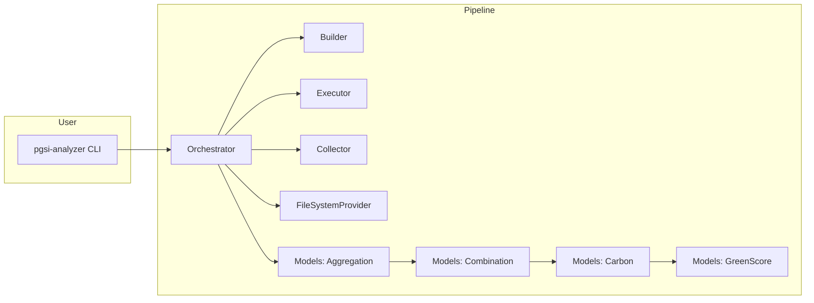
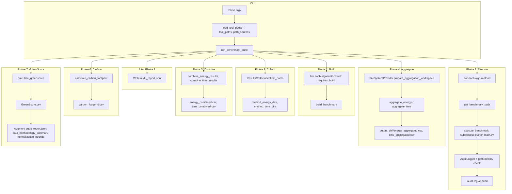
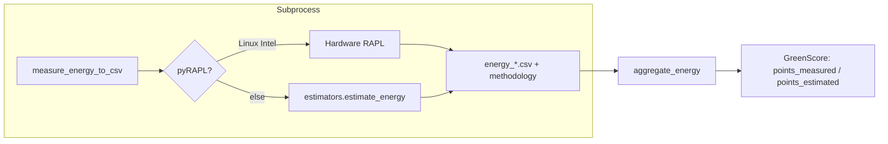

# PGSI Analyzer — Architecture

**Purpose:** Technical architecture for the Python GreenScore and Sustainability Analysis Tool. Suitable for open-source maintainers and research readers.

---

## 1. High-Level Overview

**pgsi-analyzer** measures and ranks Python execution methods (CPython, PyPy, Cython, ctypes, py_compile) by energy consumption, execution time, and carbon footprint. The system runs benchmarks as subprocesses, collects raw energy and time CSVs, aggregates them per method, combines across methods, computes carbon from energy, and produces a **GreenScore** ranking (lower = more sustainable).



**Design principles:**
- **Separation of concerns:** CLI → orchestration → execution → measurement → data processing. Filesystem I/O is isolated in `FileSystemProvider`; path/layout logic is testable without disk access.
- **Single source of truth:** `benchmarks/registry.py` defines which algorithms and methods exist. Configuration (`config.py`) resolves tool paths from CLI, env, and .env.
- **Auditability:** Execution is logged to `.audit.log`; path identity (requested vs resolved vs runtime-reported) is recorded in `audit_report.json`; methodology (hardware vs estimated) is tracked in raw CSVs and GreenScore output.

---

## 2. System Components and Responsibilities

| Component | Location | Responsibility |
|-----------|----------|----------------|
| **CLI** | `cli/main.py` | Parse `benchmark list` / `benchmark run`; load tool paths and path sources; call `run_benchmark_suite`. |
| **Orchestrator** | `benchmark/orchestrator.py` | Resolve algorithms/methods; drive Phase 1 (build) → Phase 2 (execute) → Phase 3 (collect) → Phase 4 (aggregate) → Phase 5 (combine) → Phase 6 (carbon) → Phase 7 (GreenScore); write `audit_report.json`; no direct `shutil` or complex path logic. |
| **FileSystemProvider** | `benchmark/provider.py` | Workspace creation; copy raw CSVs by pattern (`energy_*.csv`, `time_*.csv`); resolve output paths (aggregated, combined, carbon, GreenScore); `collect_aggregated_paths`. Injected into orchestrator for testability. |
| **ResultsCollector** | `benchmark/results_collector.py` | Group raw CSV paths by method from `execution_results`; delegate workspace/path to `FileSystemProvider`; define file-type constants and regex patterns. |
| **Executor** | `benchmark/executor.py` | Resolve Python/PyPy path; run benchmark subprocess with `PYTHONPATH`, `PGSI_RUNS`; path identity check; append to `.audit.log`; discover energy/time CSVs; optional `AuditLogger` for `audit_report.json`. |
| **Builder** | `benchmark/builder.py` | Build Cython (setup.py build_ext) and ctypes (compile .c → shared lib); `requires_build(method)`. |
| **Registry** | `benchmarks/registry.py` | `BENCHMARKS` map; `list_algorithms`, `list_methods`, `get_benchmark_path`, `validate_algorithm`, `validate_method`; `VALID_METHODS` for audit whitelist. |
| **Measurement** | `measurement/energy.py`, `measurement/time.py`, `measurement/estimators.py` | Decorators `measure_energy_to_csv`, `measure_time_to_csv`; pyRAPL (Linux/Intel) or estimation; methodology tags in CSV. |
| **Models** | `models/aggregation.py`, `combination.py`, `carbon.py`, `greenscore.py` | Aggregate raw CSVs; combine per-method; carbon from energy; GreenScore with methodology counts and consistency flag. |
| **Platform** | `platform/detection.py`, `platform/hardware.py`, `platform/paths.py` | Detect OS/arch (e.g. Linux Intel for RAPL); CPU info; RAPL permission warnings. |
| **Config** | `config.py` | `ToolPaths`; `load_tool_paths(..., env_file, cli_*)` → `(ToolPaths, path_sources)`; `get_measurement_runs(algorithm)`; `DEFAULT_PARAMS`; `verify_tool_paths_against_env`. |
| **Utils** | `utils/errors.py`, `utils/validation.py` | `PGSIAnalyzerError`, `MeasurementError`, `AnalysisError`, `PlatformError`, `ConfigurationError`, `AuditError`; validation helpers. |

---

## 3. Module Structure

```
src/pgsi_analyzer/
├── __init__.py
├── config.py                    # ToolPaths, load_tool_paths, get_measurement_runs, DEFAULT_PARAMS
├── cli/
│   ├── __init__.py
│   └── main.py                  # argparse; benchmark list/run → run_benchmark_suite
├── benchmark/
│   ├── __init__.py              # build_benchmark, execute_benchmark, run_benchmark_suite, FileSystemProvider
│   ├── orchestrator.py          # run_benchmark_suite; phases 1–7; optional provider
│   ├── provider.py              # FileSystemProvider: prepare_aggregation_workspace, get_output_path, collect_aggregated_paths
│   ├── results_collector.py     # ResultsCollector: collect_paths; delegates to provider
│   ├── executor.py              # execute_benchmark, AuditLogger, get_runtime_executable
│   └── builder.py               # build_benchmark, requires_build
├── benchmarks/
│   ├── __init__.py
│   ├── registry.py              # BENCHMARKS, list_algorithms, list_methods, get_benchmark_path, VALID_METHODS
│   └── <algorithm>/<method>/     # e.g. hanoi/cpython, sieve/cython
│       └── main.py              # run_energy_benchmark, run_time_benchmark (decorated)
├── models/
│   ├── __init__.py
│   ├── aggregation.py           # aggregate_energy, aggregate_time; strict regex; methodology preserved
│   ├── combination.py           # combine_energy_results, combine_time_results
│   ├── carbon.py                # calculate_carbon_footprint
│   └── greenscore.py            # normalize_metrics, calculate_greenscore; points_measured/estimated; data_source_consistency
├── measurement/
│   ├── __init__.py
│   ├── energy.py                # measure_energy_to_csv; pyRAPL or estimation; methodology column
│   ├── time.py                  # measure_time_to_csv
│   └── estimators.py            # estimate_energy variants; methodology tags
├── platform/
│   ├── __init__.py
│   ├── detection.py             # detect_platform, is_linux_intel, is_windows, is_macos
│   ├── hardware.py              # get_cpu_info, get_system_info, check_rapl_support, warn_if_rapl_unavailable
│   └── paths.py                 # get_user_data_dir, resolve_data_path, resolve_benchmark_path
└── utils/
    ├── __init__.py
    ├── errors.py                # PGSIAnalyzerError, MeasurementError, AnalysisError, PlatformError, ConfigurationError, AuditError
    └── validation.py             # validate_file_path, validate_dataframe, validate_weights, require_columns
```

---

## 4. Benchmark Execution Pipeline

End-to-end flow when the user runs `pgsi-analyzer benchmark run --algorithms hanoi --methods cpython pypy --output results`:



1. **Phase 1:** For each (algorithm, method) where `requires_build(method)` is true (cython, ctypes), call `build_benchmark`; on exception log and continue.
2. **Phase 2:** For each (algorithm, method), resolve benchmark path (built path if available, else registry); call `execute_benchmark` with `AuditLogger`; executor runs path identity check, sets `PYTHONPATH` and `PGSI_RUNS`, runs `subprocess.run([python, main.py], cwd=benchmark_dir)`; on success discovers energy/time CSV paths; appends to `.audit.log`. On exception log and continue.
3. **After Phase 2:** Orchestrator writes `audit_report.json` from `AuditLogger.to_report_dict(path_sources)`.
4. **Phase 3:** `ResultsCollector(provider=fs_provider).collect_paths(execution_results)` → `{ "energy": { method: [dirs] }, "time": { method: [dirs] } }`.
5. **Phase 4:** For each method with collected dirs, `fs_provider.prepare_aggregation_workspace(output_dir, method, raw_dirs, "energy"|"time")` (copies `energy_*.csv` / `time_*.csv` into `temp_energy_<method>` / `temp_time_<method>`); then `aggregate_energy` / `aggregate_time` write to `output_dir/<method>/energy_aggregated.csv`, `time_aggregated.csv` (paths from `fs_provider.get_output_path`).
6. **Phase 5:** If no aggregated data, raise `AnalysisError`. Else `combine_energy_results` and `combine_time_results` produce `energy_combined.csv`, `time_combined.csv` (paths from provider).
7. **Phase 6:** `calculate_carbon_footprint(energy_combined_path, ...)` → `carbon_footprint.csv`.
8. **Phase 7:** `calculate_greenscore(energy_df, time_df, carbon_df, ..., aggregated_energy_paths=...)` → `GreenScore.csv` with `points_measured`, `points_estimated`, `data_source_consistency`. Orchestrator then augments `audit_report.json` with `data_methodology_summary` and `normalization_bounds`.

---

## 5. Energy Measurement Architecture

- **Linux x86_64 (Intel):** `measurement/energy.py` uses **pyRAPL** for hardware energy (package + optional DRAM). If import/setup fails (e.g. permissions), `warn_if_rapl_unavailable` emits a warning and the decorator falls back to estimation. Raw CSV includes `methodology` = `hardware_rapl_linux`.
- **Other platforms / fallback:** `measurement/estimators.py` provides CPU-time/TDP-based estimation. Estimators return `(energy_microjoules, model_name, methodology_tag)` with tags `estimated_cpu_tdp` or `estimated_fallback_generic`. These are written into the raw energy CSV `methodology` column.
- **Optional dependencies:** `psutil` is optional (e.g. PyPy may fail to load it); estimation falls back to CPU-time-only when `psutil` is unavailable. `py-cpuinfo` is used for CPU model/TDP lookup where available.
- **Data flow:** Benchmark script (subprocess) → decorators write `energy_<name>.csv` and `time_<name>.csv` under `energy_benchmark/` and `time_benchmark/` in the benchmark directory. Executor discovers these paths and returns them; collector groups by method; provider copies into temp workspaces; aggregation reads and preserves `methodology`; GreenScore uses it for `points_measured` / `points_estimated` and consistency.



---

## 6. Data Processing Pipeline

| Stage | Input | Output | Module / Contract |
|-------|--------|--------|-------------------|
| **Raw energy** | N/A (decorator runs workload) | `energy_<algo>_<method>.csv`: timestamp, function, run, package (uJ), dram (uJ), measurement_method, **methodology** | `measurement/energy.py`, `measurement/time.py` |
| **Raw time** | N/A | `time_<algo>_<method>.csv`: timestamp, function, run, execution_time (s) | `measurement/time.py` |
| **Aggregation** | Folder of raw CSVs (after provider copy) | `output_dir/<method>/energy_aggregated.csv`, `time_aggregated.csv`: filename, average_package (uJ) or execution_time (s); methodology preserved in energy | `models/aggregation.py`; patterns `^energy_.*\.csv$`, `^time_.*\.csv$` |
| **Combination** | List of aggregated paths (method = parent dir name) | `energy_combined.csv`, `time_combined.csv`: algorithm + one column per method | `models/combination.py` |
| **Carbon** | energy_combined.csv | `carbon_footprint.csv`: algorithm + method columns `*_CO2e_g` | `models/carbon.py` |
| **GreenScore** | energy_combined, time_combined, carbon DataFrames + optional aggregated_energy_paths | `GreenScore.csv`: method, energy_mean, time_mean, carbon_mean, green_score, **points_measured**, **points_estimated**, **data_source_consistency** | `models/greenscore.py` |

**File naming (audit):** Only files matching `^energy_.*\.csv$` or `^time_.*\.csv$` are copied into aggregation workspaces; `.csv.tmp`, `.csv.bak`, etc. are ignored. Method name is the parent directory of aggregated files (e.g. `cpython/energy_aggregated.csv` → method `cpython`).

---

## 7. GreenScore Calculation Pipeline

- **Formula:** GreenScore = α·(normalized energy) + β·(normalized carbon) + γ·(normalized time). Weights α, β, γ default 0.4, 0.4, 0.2; normalized metrics are row-wise min-max (0–1). Lower score = better sustainability.
- **Zero variance:** If for a row all method values are equal, normalization uses `row * 0` to avoid division by zero (`models/greenscore.py`).
- **Methodology:** If `aggregated_energy_paths` is provided, GreenScore reads each method’s aggregated energy CSV and counts `methodology == "hardware_rapl_linux"` (points_measured) vs else (points_estimated). These columns are added to the output. **Data source consistency:** `"Inconsistent Data Source"` if a method has both measured and estimated points; otherwise `"Consistent"`.
- **Audit:** Orchestrator augments `audit_report.json` with `data_methodology_summary` (total_points, hardware_percentage, estimation_percentage) and `normalization_bounds` (min/max for energy, time, carbon) after Phase 7.

---

## 8. CLI Architecture

- **Entry point:** `pgsi-analyzer` → `pgsi_analyzer.cli:main` (in `pyproject.toml`). `cli/__init__.py` exports `main` from `cli/main.py`.
- **Commands:** `benchmark list` (list algorithms/methods); `benchmark run` (full suite).
- **Run arguments:** `--algorithms`, `--methods` (default `all`), `--runs`, `--output`, `--carbon-intensity`, `--alpha`, `--beta`, `--gamma`, `--env-file`, `--python-path`, `--pypy-path`, `--cc-path`.
- **Flow:** Parse argv → for `run`, call `load_tool_paths(...)` (returns `(tool_paths, path_sources)`), then `orchestrator.run_benchmark_suite(..., tool_paths=tool_paths, path_sources=path_sources)`. CLI does not instantiate `FileSystemProvider`; orchestrator uses default provider unless one is passed (e.g. in tests).
- **Error handling:** CLI catches `PGSIAnalyzerError` (and general `Exception`), prints message and returns non-zero exit code.

---

## 9. Configuration System

- **ToolPaths:** Dataclass `python`, `pypy`, `c_compiler` (all `Path`; pypy/c_compiler optional). Used by builder and executor.
- **load_tool_paths(env_file, cli_python, cli_pypy, cli_cc, auto_load_env):** Optional .env load; resolve python (cli → PGSI_PYTHON_PATH → sys.executable), pypy (cli → PGSI_PYPY_PATH → find on PATH), c_compiler (cli → PGSI_CC_PATH → find on PATH). Returns `(ToolPaths, path_sources)` where `path_sources` records per-tool `path` and `source` (`"cli"`, `"env"`, or `"system_default"`). Calls `verify_tool_paths_against_env(tool_paths)` after resolution.
- **get_measurement_runs(algorithm):** Returns `int(os.environ.get("PGSI_RUNS", default))` with default from `DEFAULT_PARAMS[algorithm]["test_n"]` or 50. Used by benchmark scripts inside subprocess (executor sets `PGSI_RUNS`).
- **DEFAULT_PARAMS:** Per-algorithm defaults (test_n, depth, n, etc.) for benchmarks when not overridden by `PGSI_RUNS`.

---

## 10. Extensibility Design

**Adding a new algorithm:**
1. Create `src/pgsi_analyzer/benchmarks/<algorithm>/<method>/main.py` for each method (cpython, pypy, cython, ctypes, py_compile as needed). Each `main.py` must call `run_energy_benchmark` and `run_time_benchmark` decorated with `measure_energy_to_csv` / `measure_time_to_csv` with `csv_filename` like `"<algo>_<method>"` (so output is `energy_<algo>_<method>.csv`, `time_<algo>_<method>.csv`).
2. Use `get_measurement_runs(algorithm)` (or equivalent) for decorator `n` so `--runs` is honored.
3. Add the algorithm and its methods to `BENCHMARKS` in `benchmarks/registry.py`. Paths are relative to the benchmarks package (e.g. `"my-algo/cpython/main.py"`).
4. Run `pgsi-analyzer benchmark list --algorithms` to verify; then `benchmark run --algorithms my-algo --methods cpython`.

**Adding a new execution method:**
1. Implement the method’s benchmark tree under `benchmarks/<algorithm>/<new_method>/` for each algorithm (or a subset).
2. Extend `BENCHMARKS` in `registry.py` with the new method key and paths.
3. Add the method to `VALID_METHODS` in `registry.py` (for collector audit).
4. If the method requires a build step, extend `benchmark/builder.py` and `requires_build` so Phase 1 builds it; ensure `executor.py` can resolve the interpreter (e.g. add to `find_python_executable` or builder logic as needed).

**Testing pipeline without disk I/O:** Pass a mock `FileSystemProvider` (e.g. `MagicMock(spec=FileSystemProvider)`) into `run_benchmark_suite(..., provider=mock_provider)` and configure the mock’s `prepare_aggregation_workspace` and `get_output_path` return values. The orchestrator then runs the full phase sequence without real file copies or path creation.

---

## 11. Dependency Overview

- **CLI** → orchestrator, config, registry (list).
- **Orchestrator** → provider, results_collector, registry, builder, executor, models (aggregation, combination, carbon, greenscore), config (ToolPaths), utils (AnalysisError).
- **Executor** → config (ToolPaths), platform (detection), utils (MeasurementError, PlatformError).
- **Provider** → results_collector (constants and patterns only; no circular call).
- **ResultsCollector** → provider (optional), registry (VALID_METHODS), utils (AuditError).
- **Measurement** → platform (hardware, detection), estimators.
- **Models** → pandas; no dependency on benchmark or measurement at import time.
- **Config** → os, sys, pathlib, optional dotenv; no dependency on benchmark/measurement.

Import order that avoids cycles: utils → platform → config → benchmarks.registry → models → measurement → benchmark.builder → benchmark.executor → benchmark.provider / results_collector → benchmark.orchestrator → cli.main.
